# SoilMonitor3

Project using an ESP32 (DOIT ESP32 DEVKIT V1) to provide soil sensor data.
The sensors used in this project are:

- ANGEEK Capacitive Soil Moisture Sensor Module
- DS18B20 Digital Temperature Sensor

## Capacitive Soil Moisture Sensor Module

~~~
Operating voltage: 3.3 ~ 5.5 VDC.
Output voltage:    0 ~ 3.0 VDC.
Interface:         PH2.54-3P
Dimensions:        98 mm x 23 mm (3.86 in x 0.905 in)
Weight:            15 g.
~~~
The product includes an on-board voltage regulator 
which gives it an operating voltage range of 3.3 ~ 5.5V. 
It is compatible with low-voltage MCUs (both 3.3V and 5V logic). 
An analogue input signal pin can be used for the conversion module to work.

### Capacitive Moisture Sensor

A capacitive moisture sensor works by measuring the changes in 
capacitance caused by the changes in the dielectric. 
Capacitive measuring basically measures the dielectric 
that is formed by the soil and the water is the most important 
factor that affects the dielectric.

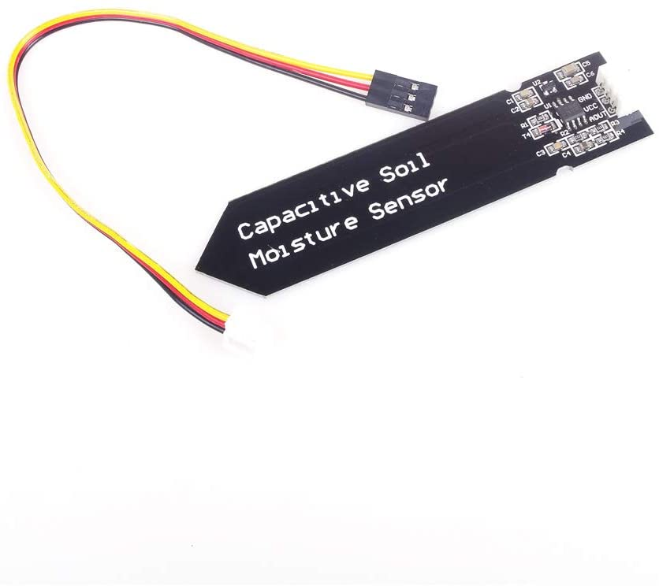

The capacitance of the sensor is measured by means 
of a 555 based circuit that produces a voltage proportional 
to the capacitor inserted in the soil. 
We then measure this voltage by use of an Analog to 
Digital Converter (ADC) which produces a number that we 
can then interpret as soil moisture.

## DS18B20 Digital Temperature Sensor

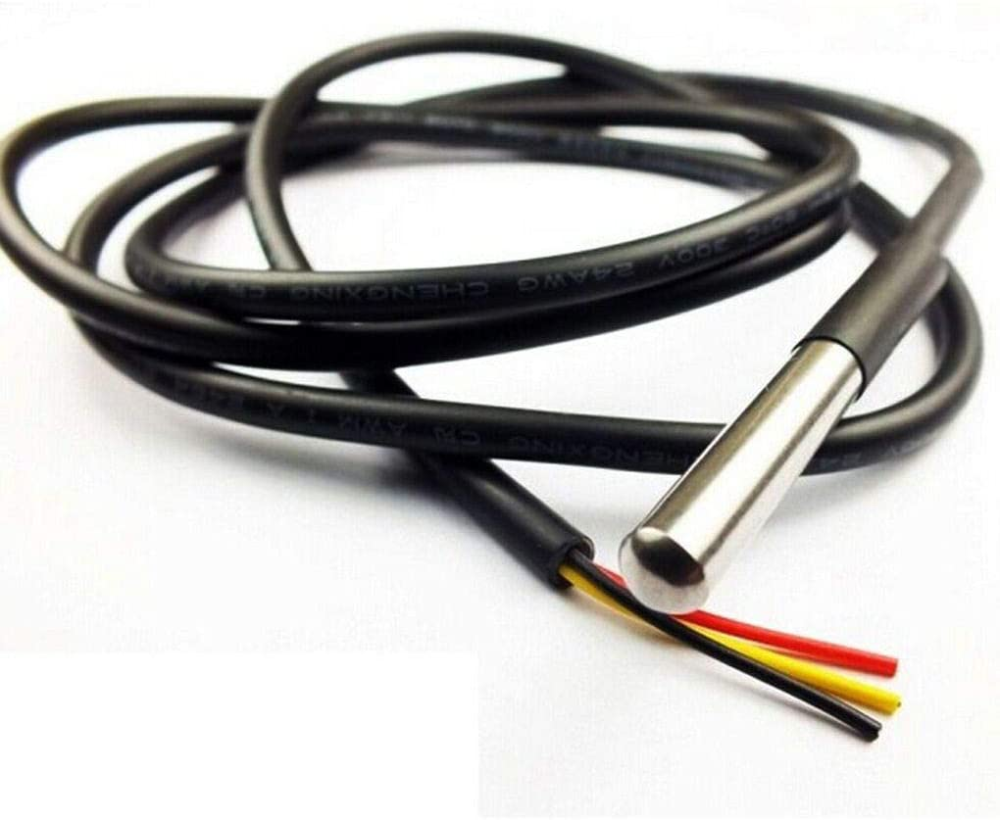

~~~
Chip used:                   original DS18B20
Stainless steel tube size:   approx. 6 x 50 mm (diameter x length).
Cable length:                approx. 300 cm
Power supply:                3.0 V - 5.5 V.
Operating temperature range: -55 °C ~ 125 °C (-67 °F - 257 °F).
Storage temperature range:   -55 °C ~ 125 °C (-67 °F - 257 °F).
Cable connections:           rot (VCC), yellow(DATA), black(GND)
~~~
An high quality stainless steel tube encapsulation is 
waterproof and moisture-proof to prevent rust.

### DS18B20

The DS18B20 digital thermometer provides 9-bit to
12-bit Celsius temperature measurements and has an
alarm function with nonvolatile user-programmable upper
and lower trigger points. The DS18B20 communicates
over a 1-Wire bus that by definition requires only one
data line (and ground) for communication with a central
microprocessor.

Each DS18B20 has a unique 64-bit serial code, which
allows multiple DS18B20s to function on the same 1-Wire
bus. 

## DOIT Esp32 DevKit v1
The DOIT Esp32 DevKit v1 is one of the development board 
created by DOIT to evaluate the ESP-WROOM-32 module. 
It is based on the ESP32 microcontroller that boasts Wifi, 
Bluetooth, Ethernet and Low Power support all in a single chip.

### Pin Layout
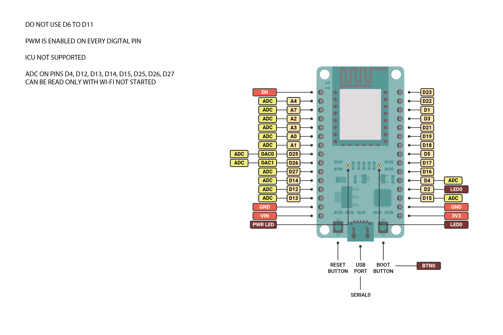

### ESP32
ESP32 is a single 2.4 GHz Wi-Fi-and-Bluetooth combo chip designed with the TSMC ultra-low-power 40 nm
technology. It is designed to achieve the best power and RF performance, showing robustness, versatility and
reliability in a wide variety of applications and power scenarios.

~~~
Microcontroller:           Tensilica 32-bit Single-/Dual-core CPU Xtensa LX6
Operating Voltage:         3.3V
Input Voltage:             7-12V
Digital I/O Pins (DIO):    25
Analog Input Pins (ADC):   6
Analog Outputs Pins (DAC): 2
UARTs:                     3
SPIs:                      2
I2Cs:                      3
Flash Memory:              4 MB
SRAM:                      520 KB
Clock Speed:               240 Mhz
Wi-Fi:                     IEEE 802.11 b/g/n/e/i
~~~

WiFi has an integrated TR switch, balun, LNA, power amplifier and supports matching network
WEP or WPA/WPA2 authentication, or open networks.

### Flash Layout

The internal flash of the ESP32 module is organized in a 
single flash area with pages of 4096 bytes each. 
The flash starts at address 0x00000, but some areas are 
reserved for OTA or boot loader. 

Several different layouts can be used based on the presence of BLE support.
This project uses WiFi and Bluetooth and therefore requires a large program space.
The OTA (over the air) updates are not supported in the selected flash layout (50-00-50).

# Development

A set of tools are used for the development.

- Arduino IDE
- Microsoft Visual Studio Community 2019
- Arduino IDE for Visual Studio (Visual Micro)

## Arduino IDE
The open-source Arduino Software (IDE) makes it easy to write code and upload it to the board. 
It runs on Windows, Mac OS X, and Linux. The environment is written in Java and based on 
Processing and other open-source software.
This software can be used with any Arduino board and is available at https://www.arduino.cc/en/Main/Software.

### ESP32 Support
Add https://dl.espressif.com/dl/package_esp32_index.json into the “Additional Board Manager URLs” field in the *Preferences* dialog box.

## Microsoft Visual Studio Community 2019

Visual Studio Community Edition is a fully-featured, extensible, free IDE for 
creating modern applications for Android, iOS, Windows, as well as web applications 
and cloud services and can ve downloaded from https://visualstudio.microsoft.com/downloads/.

## Arduino IDE for Visual Studio (Visual Micro)

Visual Micro for VS2017 and VS2019 is a fully compatible Arduino Edit, Build , Deploy and Debug tool.
All Arduino IDE versions are supported.
- Supports an Arduino Compatible Build, Upload + Software and Hardware Debugging.
- Supports multiple serial monitors
- Save board, board options, port for each project or for each project configuration.
- Debug options are saved per board and project configuration. 
- Unique USB/WiFi debugger or GDB debugging.
- Shares the same configuration as the Arduino IDE.

Download from https://marketplace.visualstudio.com/items?itemName=VisualMicro.ArduinoIDEforVisualStudio.

## Libraries

A set of Arduino libraries are used:

- ArduinoLog
- aWOT
- BluetoothSerial
- Commander
- DallasTemperature
- ESP32Ping
- FS
- JLed
- OneWire
- Smoothed
- SPIFFS
- WiFi

### ArduinoLog

ArduinoLog is a minimalistic framework to help the programmer output log statements to an output of choice, fashioned after extensive logging libraries such as log4cpp ,log4j and log4net. In case of problems with an application, it is helpful to enable logging so that the problem can be located. ArduinoLog is designed so that log statements can remain in the code with minimal performance cost. In order to facilitate this the loglevel can be adjusted, and (if your code is completely tested) all logging code can be compiled out.

##### Features
- Different log levels (Error, Info, Warn, Debug, Verbose )
- Supports multiple variables
- Supports formatted strings
- Supports formatted strings from flash memory
- Fixed memory allocation (zero malloc)

Source: https://github.com/thijse/Arduino-Log/.

### aWOT

aWOT is a web server library compatible with multiple different 
board architectures and networking solutions.
A set of classes are used to implement a HTTP web server:

- ##### Application
    The Application class is used for mounting Middleware 
    to Routers and to process the incoming HTTP requests.

- ##### Request
    The Request class represents the HTTP request and has 
    methods for the request query string, parameters, body, 
    HTTP headers, and so on.

- ##### Response
    The Response class represents the HTTP response that 
    an aWOT app sends when it gets an HTTP request.

- ##### Router
    A Router is an isolated instance of middleware and 
    routes. You can think of it as a “mini-application,” 
    capable only of performing middleware and routing functions. 
    Every aWOT application has a built-in default router.

Source: https://github.com/lasselukkari/awot.

### BluetoothSerial

A simple Serial compatible library using ESP32 classical 
bluetooth and the Serial Port Profile (SPP).
It is included in Esp32 support package.

**NOTE**: Due to the size of the BluetoothSerial library 
and the memory requirements, the default partition scheme 
(32-32-36) of the Esp32 is not sufficient (max. program size 
1310720 bytes). Therefore, a different partition scheme is 
used (50-00-50), allowing for max. program size of 2097152 
bytes and an increased SPIFFS size (2027520).
No OTA-only memory allows no wireless update.

See also: https://espacerm.com/webgen/2019/01/09/esp32-augmentation-de-lespace-memoire-pour-le-code-programme/.

### Commander

Commander is a system for handling commands sent over serial 
ports or other Stream objects. It allows you to define a list 
of text commands, a function to handle each command, and some 
help text that can be displayed when the 'help' command is sent. 
All the work of reading the incoming stream data, identifying 
the appropriate function and calling the handler is done by the 
commander object. It will run on most Arduino boards but is more 
suited to devices with large memory.

Commander is attached to Stream object so it can be used with 
Serial ports, files on a SD cards, or Bluetooth Serial and other 
Stream based objects on wireless capable Arduinos such as the ESP32.

Source: https://github.com/CreativeRobotics/Commander.

### DallasTemperature

Arduino Library for Maxim Temperature Integrated Circuits.

This library supports the following devices :

- DS18B20
- DS18S20 - Please note there appears to be an issue with this series.
- DS1822
- DS1820
- MAX31820

Source: https://github.com/milesburton/Arduino-Temperature-Control-Library.

**NOTE**: This library requires the *OneWire* library.

### ESP32Ping

With this library an ESP32Ping can ping a remote machine and know if it's reachable. 
It provide some basic measurements on ping messages (avg response time).

Source: https://github.com/marian-craciunescu/ESP32Ping.

### JLed

A library to control LEDs. It uses a non-blocking approach and can control LEDs 
in simple (on/off) and complex (blinking, breathing and more) ways in a 
time-driven manner.

Source: https://github.com/jandelgado/jled.

### OneWire

OneWire lets you access 1-wire devices made by Maxim/Dallas, 
such as temperature sensors and ibutton secure memory.

Source: https://github.com/PaulStoffregen/OneWire.

### Smoothed

An Arduino library to store and smooth sensor inputs using various methods including:

- a simple moving average of the last x sensor readings
- a simple linear recursive exponential filter

Source: https://github.com/MattFryer/Smoothed.

### FS
Filesystem virtualization framework. It is included in Esp32 support package.

### SPIFFS
Esp32 SPIFFS support. The Serial Peripheral Interface Flash File System (SPIFFS) 
is a file system intended for SPI NOR flash devices on embedded targets. It supports 
wear levelling, file system consistency checks, and more. 
It is included in Esp32 support package.

**NOTE**: Currently, SPIFFS does not support directories, it produces a flat structure.

### WiFi
Esp32 Wifi support. It is based on the WiFi library from Arduino WiFi shield library and is included in Esp32 support package.
The WiFi libraries provide support for configuring and monitoring the ESP32 WiFi networking functionality. 
This includes configuration for:

- Station mode (aka STA mode or WiFi client mode). ESP32 connects to an access point.
- AP mode (aka Soft-AP mode or Access Point mode). Stations connect to the ESP32.
- Combined AP-STA mode (ESP32 is concurrently an access point and a station connected to another access point).
- Various security modes for the above (WPA, WPA2, WEP, etc.)
- Scanning for access points (active & passive scanning).
- Promiscuous mode for monitoring of IEEE802.11 WiFi packets.

# Settings

All application settings are stored in a single JSON file in SPIFFS.
It contains the WiFi related settings (AP, STA), the logging and 
commander sections, and the settings for the soil moisture and 
temperature sensors (max. 6 sensors each).

##### /settings.json
~~~ JSON
{
  "AP": {
    "Backup": true,
    "SSID": "ESP32",
    "PASS": "",
    "Hostname": "soilmonitor",
    "Custom": false,
    "Address": "",
    "Gateway": "",
    "Subnet": "255.255.255.0"
  },
  "STA": {
    "SSID": "",
    "PASS": "",
    "Hostname": "soilmonitor",
    "DHCP": true,
    "Address": "",
    "Gateway": "",
    "Subnet": "255.255.255.0",
    "DNS1": "",
    "DNS2": ""
  },
  "Log": {
    "Level": "ERROR",
    "All": "ERROR",
    "WiFi": "ERROR",
    "Dhcps": "ERROR",
    "Dhcpc": "ERROR"
  },
  "Cmd": {
    "Prompt": "cmd",
    "PassPhrase": "",
    "LocalName": "ESP32",
    "Bluetooth": false,
    "HardLock": false,
    "Locked": false,
    "ErrorMessages": true,
    "CommandPrompt": true
  },
  "Temp": {
    "Pin": 4,
    "Sensors": [
      { "Name": "Sensor 0" },
      { "Name": "N/A" },
      { "Name": "N/A" },
      { "Name": "N/A" },
      { "Name": "N/A" },
      { "Name": "N/A" }
    ]
  },
  "Soil": [
    {
      "Name": "Sensor 1",
      "Wet": 1.7,
      "Dry": 3.5,
      "Enabled": true
    },
    {
      "Name": "Sensor 2",
      "Wet": 1.7,
      "Dry": 3.5,
      "Enabled": true
    },
    {
      "Name": "Sensor 3",
      "Wet": 1.7,
      "Dry": 3.5,
      "Enabled": true
    },
    {
      "Name": "Sensor 4",
      "Wet": 1.5,
      "Dry": 3.4,
      "Enabled": false
    },
    {
      "Name": "Sensor 5",
      "Wet": 1.5,
      "Dry": 3.4,
      "Enabled": false
    },
    {
      "Name": "Sensor 6",
      "Wet": 1.5,
      "Dry": 3.4,
      "Enabled": false
    }
  ]
}
~~~

# Web Server

The web server is implented using the aWOT framework. 
Every static file (html, css, js) is stored in the SPIFFS
and returned to the caller (browser) using middleware handlers.

The following static files are used:

- /about.html
- /config.html
- /error.html
- /index.html
- /info.html
- /css/bootstrap.min.css
- /css/bootstrap-ggrid.min.css
- /css/bootstrap-reboot.min.css
- /css/soilmonitor.min.css
- /js/bootstrap.bundle.min.js
- /js/bootstrap.min.js
- /js/jquery-3.4.1.min.js
- /js/jquery.inputmask.min.js
- /js/justgage.min.js
- /js/popper.min.js
- /js/raphael-2.1.4.min.js
- /images/favicon.png

The web pages are using the REST web api to retrieve sensor data
and application settings using HTTP GET. HTTP POST calls can be used 
to modify settings.
~~~
    GET
        /ap            
        /sta           
        /err           
        /server        
        /system        
        /soil          
        /temp          
        /data          
        /settings      
        /settings/ap   
        /settings/sta  
        /settings/log  
        /settings/cmd  
        /settings/soil 
        /settings/temp 
    
    POST
        /err           
        /save          
        /reset         
        /reboot        
        /settings      
        /settings/ap   
        /settings/sta  
        /settings/log  
        /settings/cmd  
        /settings/soil 
        /settings/temp 
~~~

### index.html

The web page shows a typical application using a single temperature sensor and three 
soil moisture sensors.

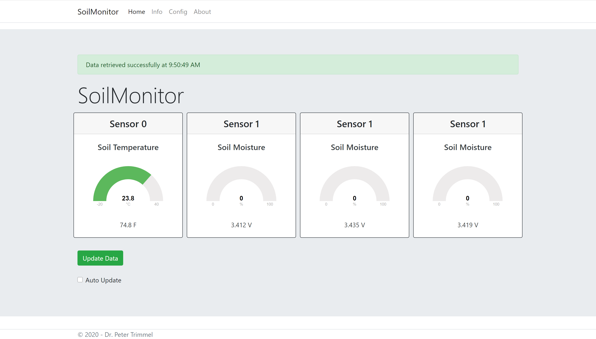

New data are requested using a REST call (/data).

### info.html

The web page shows all sensor settings and informations.
The temperature sensor settings contain *Name*, *Address*, *Resolution*, and *Connection*.

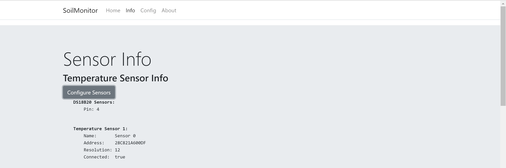

The OneWire pin number, and the temperature sensor names can be changed.

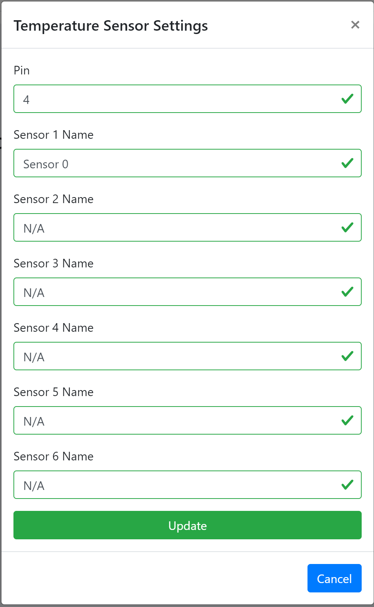

The soil moisture sensor settings containt *Name*, *Pin*, *Wet* and *Dry* values, and *Enabled* state.

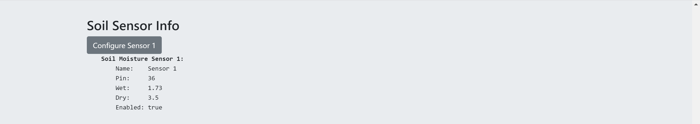

Also the soil moisture sensor settings can be modified. The *Wet* and *Dry* values are used to calibrate the sensors.

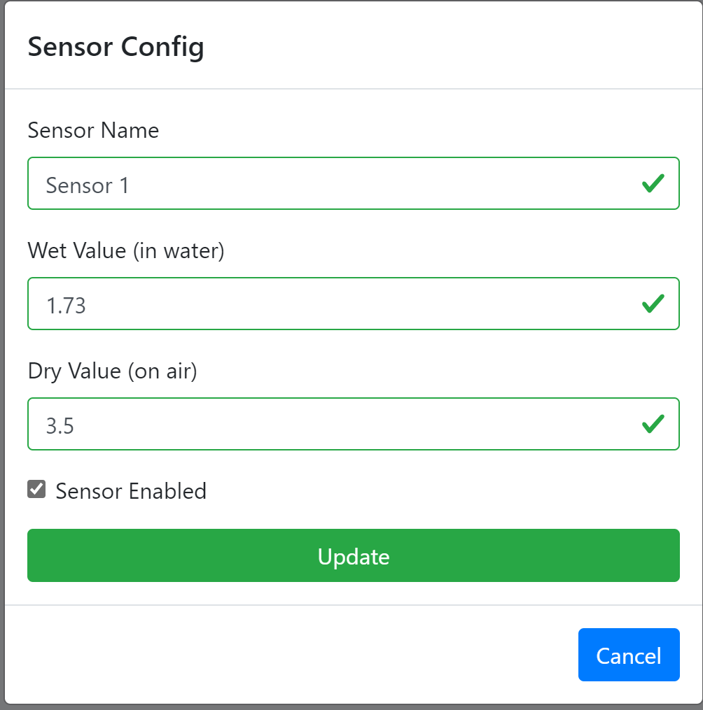

### config.html

The web page shows web server, WiFi information (AP, STA), logging, and commander settings. 

The access point settings can be changed, allowing for custom settings.

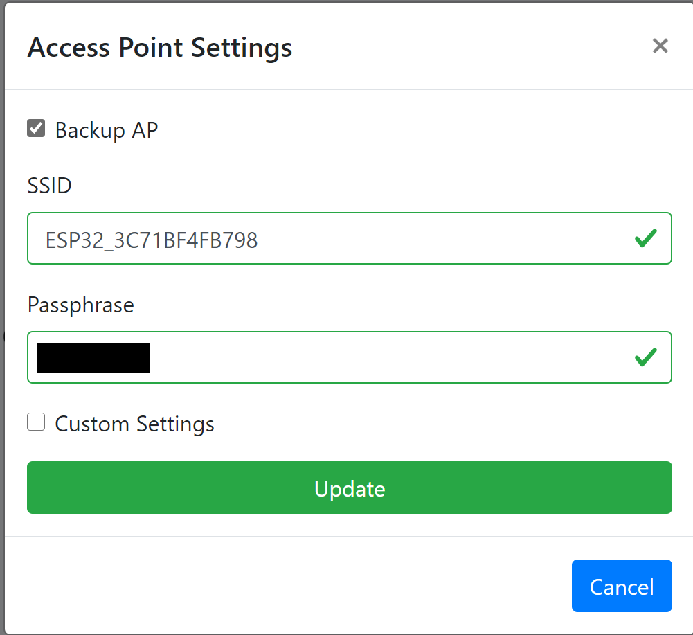 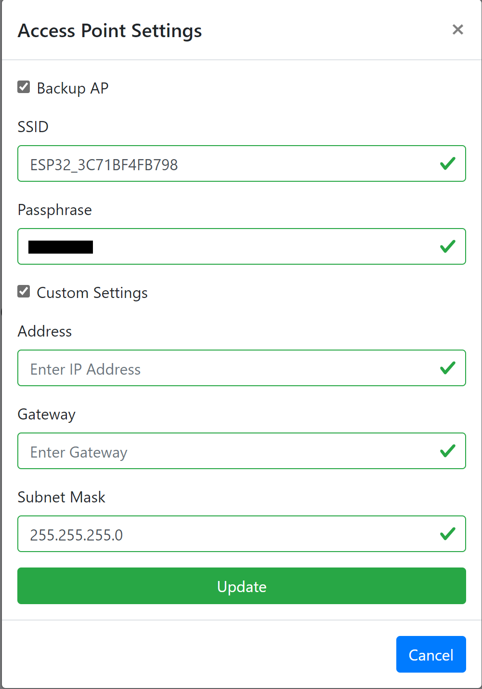

The WiFi configuration (connection to an existing network) can use DHCP or a specific IP address.
A reset of all WiFi settings to the dafault (single access point) can be performed.

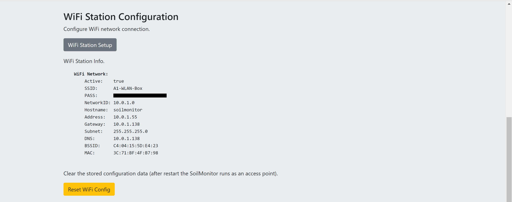

The WiFi station setup allows the modification of all relevant settings.

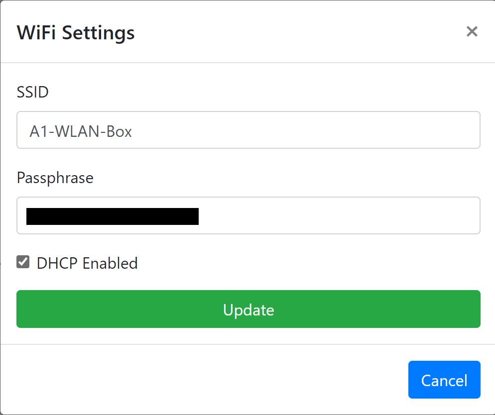 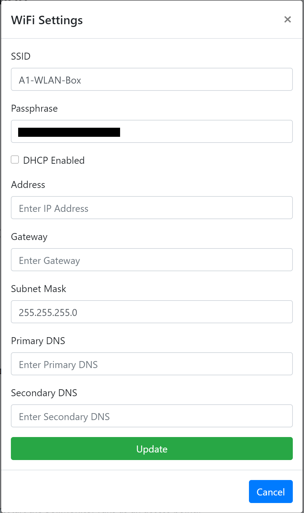

Logging and Commander settings are available.

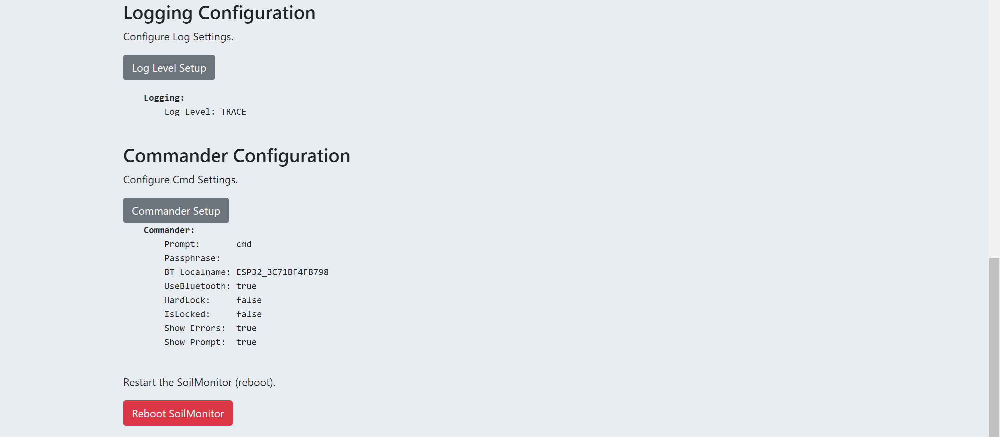

The log level can be changed, and the Commander settings modified.
Note that to apply the new commander settings a reboot is required.

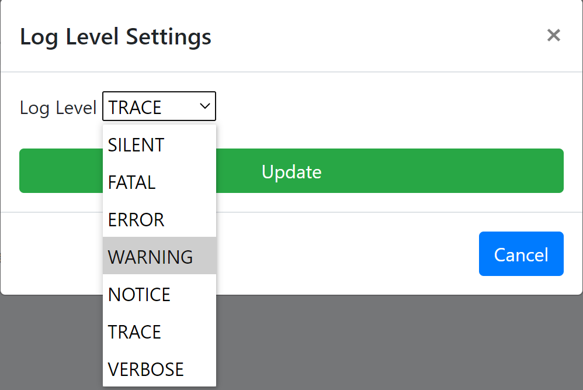 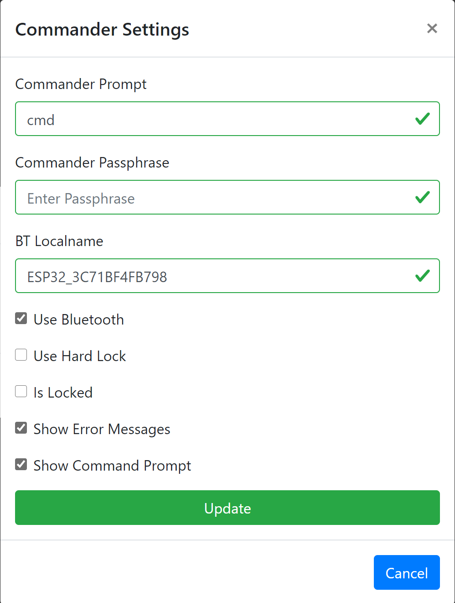

# Commander

The Commander reads a Stream and adds incoming bytes to its internal buffer. When the 
Commander encounters an end of line character (usually an ASCII newline character) it 
checks to see if the contents of the buffer begin with any of its user commands or 
internal commands. If it finds a match it then calls the command handler.

The serial (USB port) and the Bluetooth serial can be used as input/output streams.
Several commands are available:

~~~
    ap                  AP info
    sta                 show STA info
    api                 show REST API
    scan                scan WiFi network
    wifi                restart WiFi
    ping                pinging IP address
    init                intialize settings
    save                save settings
    data                show sensor data
    soil                show soil sensor data
    temp                show temp sensor data
    reset               reset WiFi settings
    level               get/set log level
    spiffs              show SPIFFS info
    server              show server info
    system              show system info
    reboot              reboot system
    version             show commander version
    bluetooth           get/set bluetooth

    format              reformat SPIFFS
    settings            get/set all settings
    settings-ap         get/set Ap settings
    settings-sta        get/set Sta settings
    settings-log        get/set Log settings
    settings-cmd        get/set Cmd settings
    settings-soil       get/set Soil settings
    settings-temp       get/set Temp settings
~~~

# Communication Setup

## Access Point

During startup (it the Backup Flag is set) a WiFi access point is created.
The default unique name (e.g. ESP32_3C71BF4FB798) is using the Esp32 
chip ID (MAC address). The default IP address is *192.168.4.1*.

## WiFi Station

When provided with an SSID and (opt.) passphrase for an existing WiFi network
a connection is established (using DHCP or a static IP address).

## Bluetooth

Bluetooth is started using a default unique name (e.g. ESP32_3C71BF4FB798) - see Access Point setup.
A smartphone Bluetooth client (Android) can be used to communicate (*Serial Bluetooth Terminal*).

If the WiFi connection is not working, the local Bluetooth serial support can be used to check and/or modify settings.
